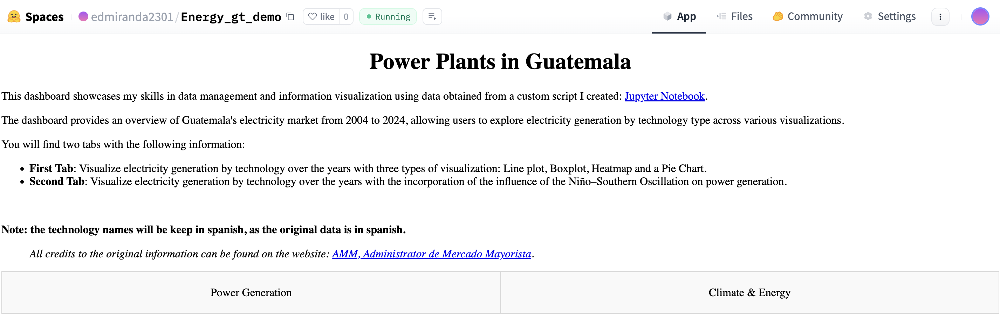
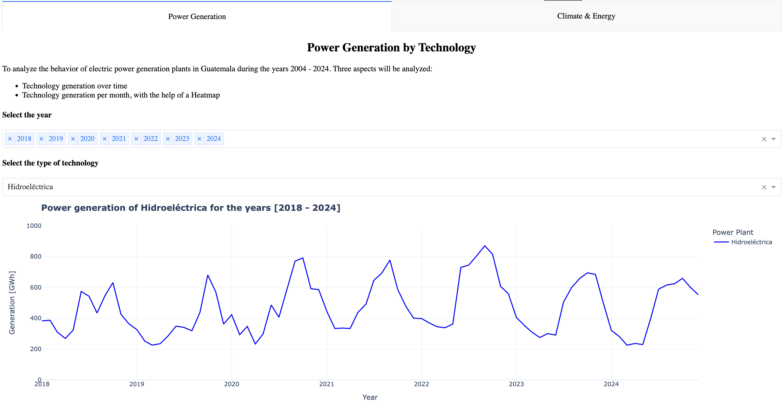
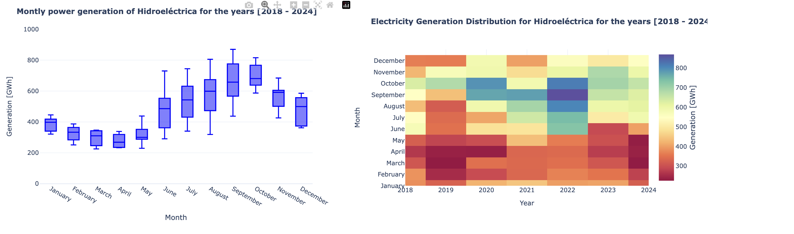
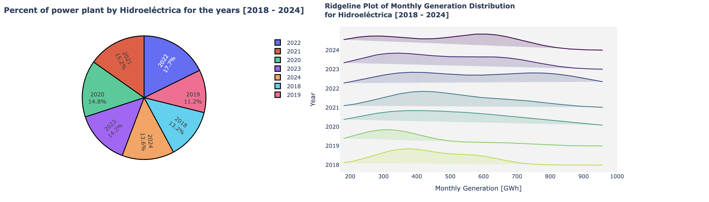
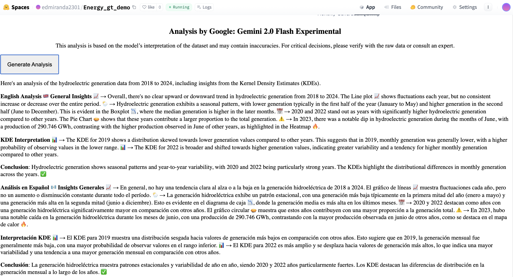
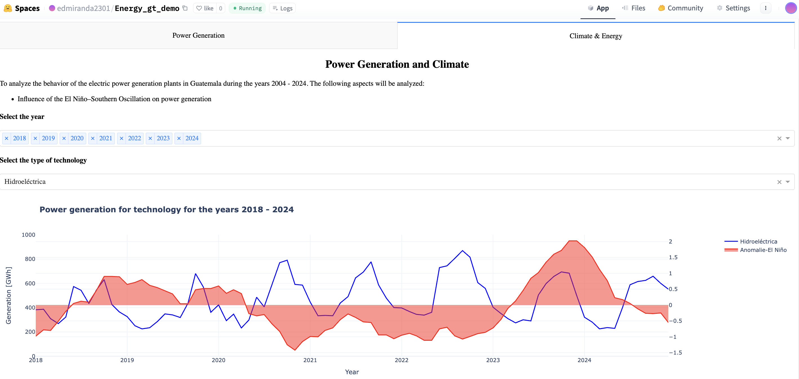
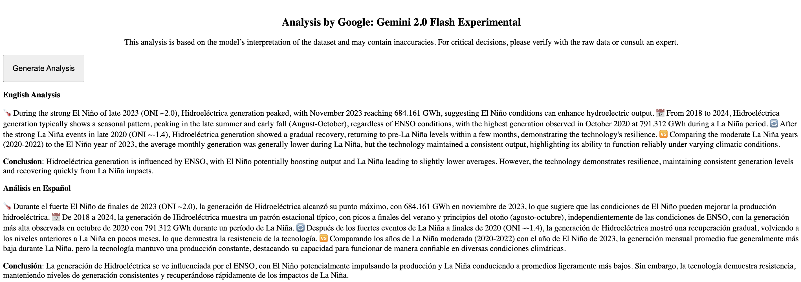

# Guatemala Energy Data Generation Scraper

This project provides tools to extract, clean, and save energy data from Guatemala in formatted CSV files. The data is sourced from the open data portal of the AMM (Administrador de Mercado Mayorista): [https://reportesbi.amm.org.gt/](https://reportesbi.amm.org.gt/)

## Overview

There are two main scrapers:

### 1. Energy Demand Scraper
- Uses [Playwright](https://playwright.dev/) to extract data from the website.
- The website is tricky and buggy, so human intervention is required during extraction.
- Data is extracted in hourly format, with each iteration covering a 4-month period for the desired year.
- The script `One_year_extract.py` extract the data and saved as unstructured and uncleaned CSV files.
- The script `Extrac_desited_month_year.py` extract the data and saved as an unstructured and uncleaned CSV file for a specific month and year.
- The script `Multiple_year_extract_tecnology.py` extract the data and saved as an unstructured and uncleaned CSV file for specific years.
- The script `clean_year.py` joins, cleans, and formats the data into a wide-format CSV, then deletes the intermediate files.
- The script `Clean_technology_entire_data.py` joins, cleans, and formats the data into a wide-format CSV, for multiples years for a specific technology. It will create a CSV for each year.


### 2. Generation by Technology type Scraper
- Also uses Playwright; the website is even more buggy for this data.
- Human intervention is required, and the site may take 20–30 seconds to load.
- Technologies available to scrape are:  
  - `Eólico`  
  - `Fotovoltaica`  
  - `Geotérmica`  
  - `Motor Reciprocante`  
  - `Turbina de Gas`  
  - `Turbina de Vapor`
  - `Hidroeléctrica`
  - `¨Exportacion`  *The character `¨` is part of the name*
  - `¨Importacion`  *The character `¨` is part of the name*
- Data is extracted in hourly format, with each iteration covering a 3-month (trimester) period for the desired year.
- Extracted data is saved as unstructured, uncleaned CSV files.
- The script `One_year_extract_tecnology.py` creates a folder for the technology type, processes all files in the folder. 
- The script `Clean_tecnology_entire_data.py` clean data and will create a CSV file with the name of the technology type and year.

## Data Source
- [AMM](https://reportesbi.amm.org.gt/) - Administrador del Mercado Mayorista

## Notes
- > Human intervention is required due to website instability.
- The Project is designed as hobbyist code and learning material.
- Scrape data responsibly and in compliance with the website's terms of service.
---

## Project Structure
```
Energy_tool_scrape/
├── Control.py                            # A simple controller for the scrapers
├── One_year_extract.py                   # Scraper for energy demand data
│   └── Clean_entire_year.py              # Cleaning script for energy demand data
│   └── Extract_desired_month_year.py      # Scraper for energy demand data for a specific month and year
├── Multiple_year_extract_technology.py   # Scraper for generation by technology type for multiple years
│
├── One_year_extract_technology.py        # Scraper for generation by technology type
│   └── Clean_technology_entire_data.py    # Cleaning script for generation by technology type
├── Clean data                            # Folder containing cleaned data files (Some files to preview)
├── requirements.txt                      # Python dependencies
├── README.md                             # Project documentation
```

## Related Projects

### Guatemala Energy Dashboard Project
This companion project visualizes the data collected by this scraper tool through an interactive dashboard.
The dashboard displays the data monthly instead of hourly, decision taken to reduce resource usage on a 
free service provider like Hugging Face Space.

- **Repository**: [Guatemala's energy generation dashboard](https://github.com/your-username/guatemala-energy-dashboard)
- **Live Demo**: [Hugging Face Space](https://huggingface.co/spaces/edmiranda2301/Energy_gt_demo)

**Key Features:**
- Interactive visualization of energy generation by source in Guatemala
- Analysis of energy generation in relation to ENOS climate index
- LLM-powered analysis using Gemini 2.0 Flash Experimental API from [Openrouter](https://openrouter.ai/) 
- Built with Plotly and Dash
- Deployed with Docker

### Dashboard Screenshots

&nbsp;
<br />
<details>
  <summary>Energy generation by source images</summary>
  
  
  
  
</details>

<details>
  <summary>ENOS index correlation images</summary>
  
  
</details>

Check my [**LinkedIn**](http://www.linkedin.com/in/edgar-enrique-miranda-sandoval-a0731294) for more information about me
and my [**Hugging Face**](https://huggingface.co/spaces/edmiranda2301/Energy_gt_demo) with a dashboard using information 
obtained from the tools.
